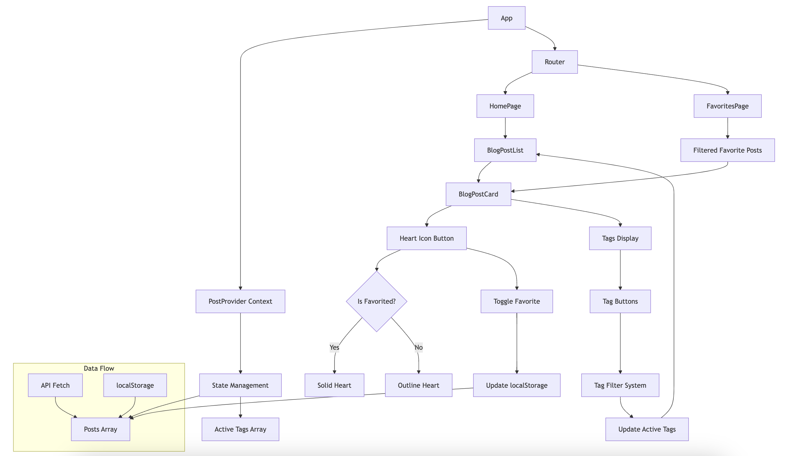

# Blog Post Management System

A React-based blog post management system built with TypeScript, featuring post favoriting and tag filtering capabilities.

## Features

- Display blog posts from external API
- Favorite/unfavorite posts with persistence
- Tag-based filtering system
- Responsive design
- Separate favorites page
- Client-side post filtering

## Stack

- React 18.3
- TypeScript
- Tailwind CSS
- React Router v7
- Vite

## Features and architectural decisions

### 1. Context-based State Management

Used React Context instead of Redux or other state management libraries for the following reasons

**Reasoning**: 
- Application scope is relatively small with predictable state updates
- No complex state transformations needed
- Reduces bundle size by avoiding external dependencies
- Built-in React solution provides sufficient functionality


### 2. Data Persistence Strategy

Used localStorage for favorites persistence

**Reasoning**:
- Provides offline capability
- No backend requirement
- Simple implementation for favorite status
- Instant updates without network requests
- Data persists across browser sessions

### 3. Component Architecture

Split into three main component types:
- Page components (PostsPage, FavoritesPage)
- Container components (BlogPostList)
- Presentational components (BlogPostCard)

**Reasoning**:
- Clear separation of concerns
- Improved maintainability
- Reusable components
- Easier testing and debugging

### 4. TypeScript Implementation

Used TypeScript with strict mode enabled

**Reasoning**:
- Type safety across the application
- Better developer experience with IDE support
- Catch errors during development
- Self-documenting code through interfaces
- Improved maintainability

### 5. Styling Approach

Used Tailwind CSS for styling

**Reasoning**:
- Utility-first approach reduces CSS maintenance
- No context switching between files
- Built-in responsive design utilities
- Consistent design system

### 6. API Integration

Fetch data on mount with local state merge

**Reasoning**:
- Single source of truth for posts
- Merges API data with local favorites
- Error handling included
- Clean separation of data fetching logic

### 7. Routing Structure

Simple two-route structure with React Router

**Reasoning**:
- Clean URL structure
- Maintained browser history
- SEO-friendly URLs


## Getting Started

### Prerequisites

- Node 18 or higher
- npm or yarn

### Installation

1. Clone or download the repository:

2. Install dependencies:
```bash
npm install
```

3. Start the development server:
```bash
npm run dev
```

4. Build for production:
```bash
npm run build
```

## Project Structure

```
src/
├── components/                 
│   ├── BlogPostCard.tsx       # Individual post display
│   └── BlogPostList.tsx       # List of posts with filtering
│
├── context/                   
│   └── PostContext.tsx        # Global post & tag state
│
├── pages/                     
│   ├── PostsPage.tsx           # Main posts page
│   └── FavoritesPage.tsx      # Favorited posts page
│
├── types/                     
│   └── types.ts              # Shared interfaces
│
├── utils/                     
│   └── contentHelper.ts       # Content parsing logic
│
├── App.tsx                    # Root component
├── main.tsx                   # Entry point
└── App.css                 # Global styles
```

## Project Diagram

